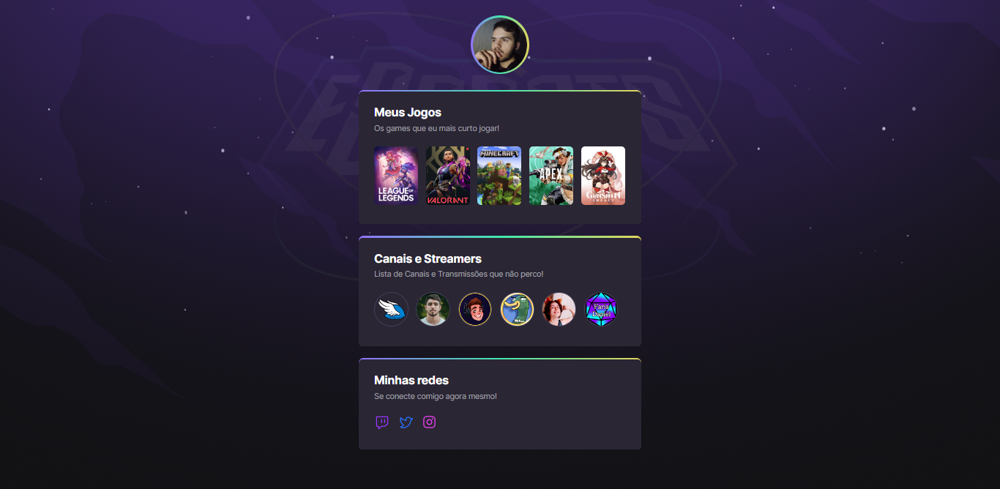

# NLW eSports - Trilha Explorer

> Trilha Explorer

Projeto construído no evento Nex Level Week da RockeSeat!

[🔗 Clique aqui para acessar](https://gstvoli.github.io/nlw-esports-explorer)

## 🛠 Tecnologias

- HTML
- CSS
- Git e Github

## 💜 Contato

guga.oli.1357@gmail.com

#

⭐ Nesse projeto eu pude treinar e reforçar sobre Desenvolvimento Web com HTML e CSS, e fixar o conhecimento a respeito de determinados temas do CSS.
